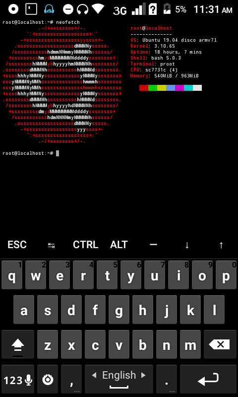

# ubuntu-in-termux
This is a script by which you can install Ubuntu in your termux application without rooted phone

# FULLY UPDATED TO UBUNTU 19.04 DISCO

Steps
1. Update termux: `pkg up`
2. Install dependencies: `pkg install wget proot git -y`
3. Go to HOME folder: `cd ~`
4. Download script: `git clone https://github.com/MFDGaming/ubuntu-in-termux.git`
5. Go to script folder: `cd ubuntu-in-termux`
6. Run script: `bash ubuntu.sh`
7. Now just start ubuntu: `./start.sh`

